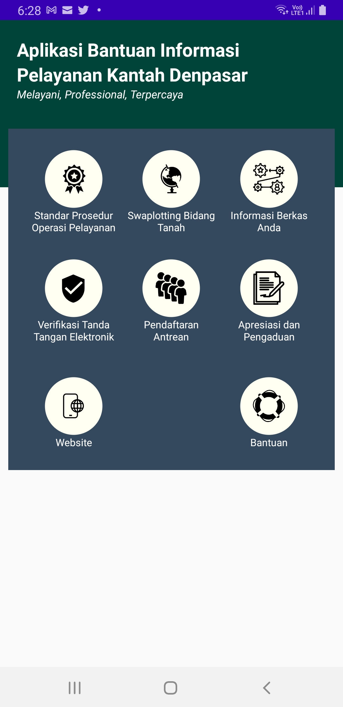

# APLIKASI ABIAN KAPAS

Abian Kapas adalah aplikasi yang digunakan sebagai aplikasi bantuan informasi di Kantor Pertanahan Kota Denpasar. Nama abian kapas diambil dari salah satu tempat di kota Denpasar dimana pusat kebudayaan yang sangat ironik dibangun yaitu Pusat Kesenian Werdhi Budaya (Werdhi Budaya Art Centre). Beberapa fitur pada aplikasi ini antara lain:

1. Informasi mengenai standar prosedur dan operasi pelayanan
2. Swaplotting bidang tanah terdaftar maupun belum terdaftar
3. Informasi berkas permohonan di Kantor Pertanahan Kota Denpasar
4. Verifikasi surat korespondensi dari Kantor Pertanahan Kota Denpasar yang ditandatangani secara elektronik
5. Pendaftaran antrean untuk pelayanan pertanahan secara daring
6. Pengaduan masyarakat
7. Situs Kantor Pertanahan Kota Denpasar

Berikut adalah tangkapan layar dari menu utama aplikasi abian kapas

