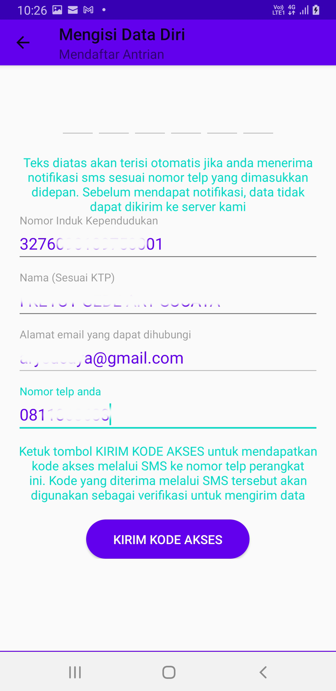

# Pendaftaran Antrean Secara Daring

Pendaftaran antrean di Loket Pelayanan Pertanahan Kantor Pertanahan Kota Denpasar dapat dilakukan darimana saja secara bertanggung jawab. Demikian pula panggilan antrean dapat di terima melalui ponsel anda sehingga menunggu giliran dapat dilakukan dari mana saja tanpa harus berkerumun di loket Pelayanan Kantor Pertanahan Kota Denpasar. Menu antrean tampak sebagai berikut:

Untuk mendaftar antrean, tekan tombol lingkaran biru di kanan bawah layar dengan ikon tanda tambah sehingga akan muncul pilihan loket sebagai berikut:

Tekan tombol daftar pada loket sesuai dengan tujuan anda ke Kantor Pertanahan Kota Denpasar. Pada gambar diatas jumlah antrean adalah jumlah antrean yang ada didepan anda. Nomor panggilan adalah nomor antrean yang sedang dipanggil saat ini. Setelah menekan tombol daftar, akan muncul pilihan alamat email. Alamat email ini akan digunakan untuk memberitahukan panggilan antrean. 

Pilih email yang anda gunakan sehari sehari. Kemudian lengkapi isian NIK dan nama lengkap sesuai KTP. Perlu diperhatikan bahwa apabila isian tidak sesuai dengan kartu identitas, kami akan membatalkan antrean anda di loket pelayanan kami. Terakhir, isi nomor ponsel yang anda gunakan untuk mendaftar antrean ini dan tekan tombol Kirim Kode Akses.

Dalam waktu beberapa detik, anda akan mendapat kode akses melalui SMS berupa 6 digit alfanumerik yang berlaku sebagai One Time Password (OTP). Kode OTP tersebut akan terisi secara otomatis dan anda dapat menekan tombol next semarang.

Setelah menekan tombol next make anda akan mendapat nomor antrean di sesuai loket yang anda pilih sebelumnya.

Klik selesai dan anda akan kembali ke jendela awal. Namun sekarang nomor antrean dan nomor panggilan di loket muncul di layar anda.

Apabila giliran anda sudah dekat, yaitu 5 antrean sebelum giliran anda anda akan menerima panggilan melalui notifikasi, SMS dan email. Segeralah menuju Kantor Pertanahan Kota Denpasar karena giliran anda sudah dekat.

Demikian pula ketika giliran anda telah tiba, selain mendapat panggilan di loket anda uga akan menerima panggilan melalui notifikasi dan SMS sebagai berikut:

Daftar panggilan yang anda terima dapat dilihat pada tab panggilan.

