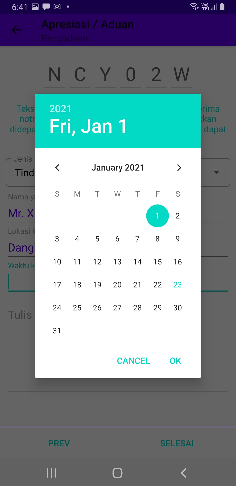
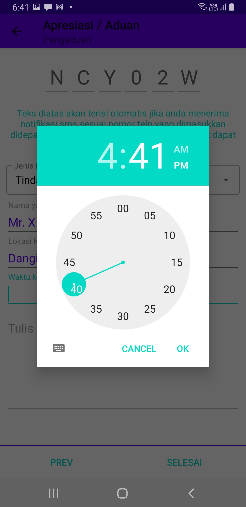

## Pengaduan Masyarakat

Apabila anda mengetahui ada penyimpangan dalam pelayanan Kantor Pertanahan Kota Denpasar, silahkan melakukan pengaduan. Caranya mudah, isi nomor telp anda dan klik kirim kode akses

Tombol next dibagian bawah akan muncul. Klik tombol ini untuk mengisi pengaduan anda.

Pengaduan harus memenuhi unsu 4W (What: peristiwa apa yang diadukan, Who: siapa oknum yang diadukan, Where: dimana lokasi terjadinya peristiwa yang diadukan, When: kapan waktu terjadinya peristiwa tersebut) dan 1H (How: bagaimana peristiwa tersebut terjadi). Isi semua aspek tersebut dengan jelas agar kami dapat menindaklanjuti pengaduan anda. Pengisian waktu terjadinya peristiwa dilakukan 2 tahap yaitu mengisi tanggal peristiwa sebagai berikut:

Setelah itu menigs jam dan menit terjadinya peristiwa. Apabila peristiwa terjadi sebelum jam 12 siang pilih AM dan apabila terjadinya setelah jam 12 siang pilih PM.

Apabila isian ada sudah lengkap, tekan tombol selesai. Kami akan langsung menerima pengaduan anda dan memverifikasi laboran tersebut. Berikut ini adalah contoh isian pengaduan yang lengkap:

