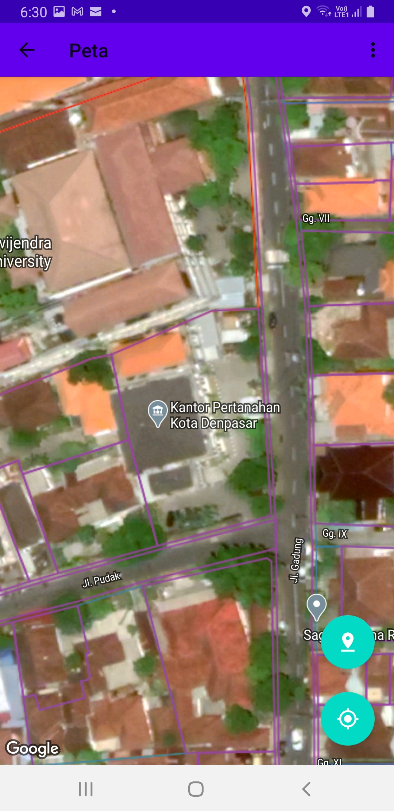
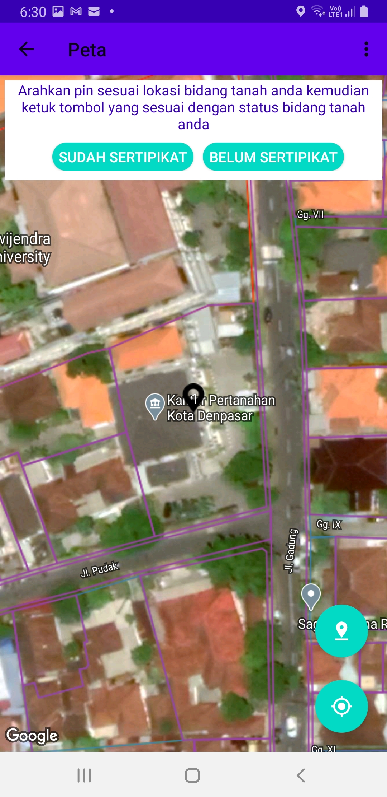
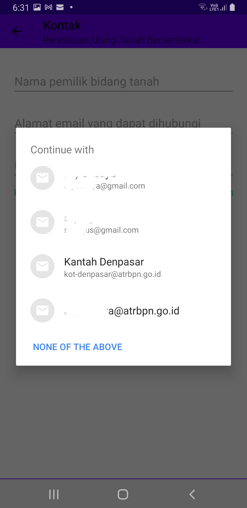
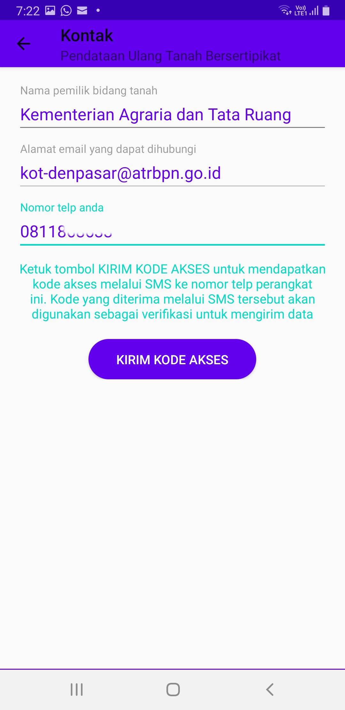
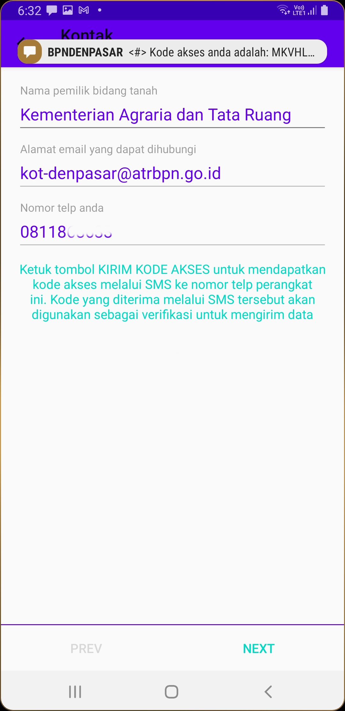
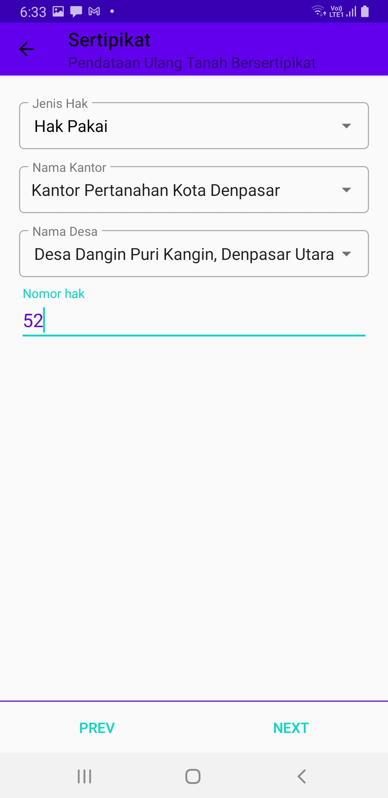
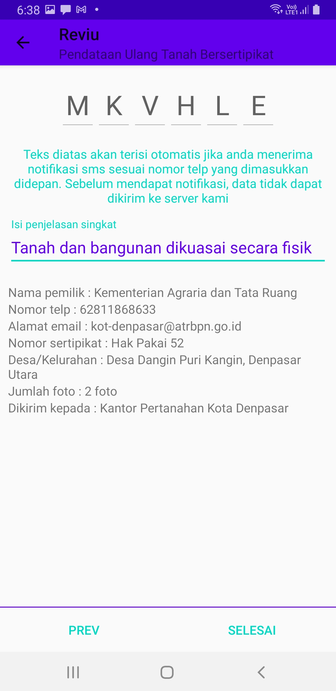

# Swaploting

Swaplotting merupakan partisipasi masyarakat untuk melaporkan letak bidang tanah yang mereka miliki agar dapat dipetakan dan divalidasi oleh petugas survey dan pemetaan Kantor Pertanahan Kota Denpasar. Swaplotting dapat dilakukan terhadap tanah yang sudah bersertipikat maupun tanah yang belum bersertipikat.

## Swaplotting Bidang Tanah Bersertipikat

Sebelum melakukan swaplotting bidang tanah bersertipikat, pastikan beberapa hal sebagai berikut:

1. Lokasi bidang tanah yang akan diplotting diketahui dan dapat diidentifikasi dengan baik diatas peta
2. Ponsel tidak dalam mode pesawat udara (airplane mode)
3. Sertipikat bidang Tanah yang akan di plotting tersedia untuk difoto sebagai lampiran swaplotting

Apabila ketiga hal tersebut telah terpenuhi, maka mulai masuk ke menu swaplotting sehingga muncul tampilan sebagai berikut:

Dibagian kanan bawah akan muncul 2 lingkaran biru. Lingkaran paling bawah digunakan untuk melakukan zoom ke lokasi anda pada saat ini. Sangat berguna jika anda sedang berdiri di bidang tanah yang sedang anda plotting. Lingkaran biru nomor 2 dari bawah digunakan untuk memulai swaplotting. Tekan tombol ini dan akan muncul tampilan sebagai berikut:

Klik sudah bersertipikat, kemudian pilih alamat email yang dihubungi apabila kami memerlukan tambahan informasi untuk melakukan validasi letak bidang tanah anda.

Setelah memilih alamat email, lengkapi isian berupa nama pemilik bidang tanah dan nomor telp ponsel yang dipakai untuk melakukan swaplotting. Pemilik bidang tanah di sesuaikan dengan nama pemilik terakhir yang tertera pada sertipikat. Apabila pemiliknya lebih dari satu, gunakan tanga titik koma (;) sebagai pemisah antar pemilik tersebut. Pastikan nomor telp yang dimasukkan adalah nomor telp ponsel yang anda gunakan untuk melakukan swaplotting karena kami akan mengirim OTP (one tipe password) untuk memverfikasi nomor telp anda sehingga kami bisa menghubungki anda jika memerlukan klarifikasi baik terhadap letak, sertipikat maupun pemiliknya. Gambar berikut adalah contoh isian data dimaksud.

Jika sudah selesai mengisi, tekan tombol tekan kode akses sehingga tombol tersebut akan menghilang dan dalam beberapa saat anda akan menerima sms OTP. Tidak perlu menunggu sampai SMS tersebut diterima, siilahkan langsung tekan tombol Next.

Selanjutnya akan muncul isian sertipikat. Pilih jenis hak yang bersesuaian dengan sertipikat anda, misalnya hak milik, hak guna bangunan, hak guna saha, hak pakai, hak pengelolaan, atau wakaf. Nama kantor akan terisi secara otomatis karena aplikasi ini hanya digunakan di Kantor Pertanahan Kota Denpasar saja. Pilih nama desa sesuai dengan desa yang disebutkan pada sertipikat anda halaman 2. Isi nomor hak sesuai dengan yang disebutkan pada sertipikat halaman 2 seperti gambar dibawah ini:

Apabila sudah isian anda benar, tekan tombol next dan isi penjelasan singkat. Text OTP berupa 6 digit karakter alfanumerik secara otomatis akan ditampilkan pada jendela ini jika anda telah menerima SMS OTP. Jika text tersebut telah terisi, silahkan klik tombol selesai

Melalui langkah sederhana dan mudah tersebut, data anda langsung terkirim kepada petugas yang membidangi kegiatan survey dan pengukuran dan mereka akan menindak lanjuti data anda segera.